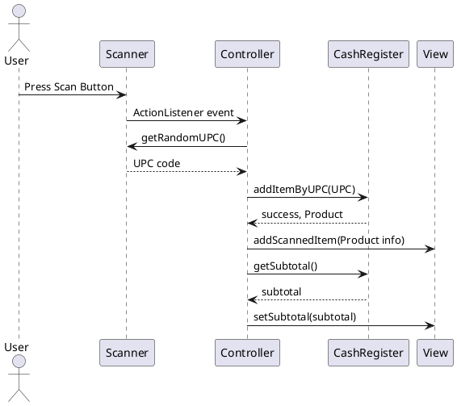

# Sequence Diagram: Scan Button Press

Below is a sequence diagram (PlantUML format) representing a single press of the scan button in the Cash Register Swing MVC application:

You can render this diagram using any PlantUML tool or online editor.
